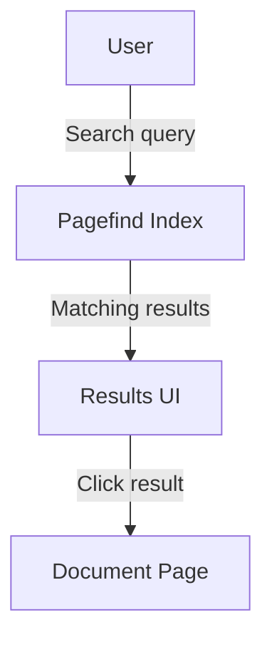

# Working with Data

This tutorial shows how to enrich your documentation with live data, diagrams, and interactive examples.

## Fetching Data at Build Time

Astro lets you fetch data from external APIs at build time using top-level `await` in `.astro` files.

```astro
---
// src/pages/stats.astro
const response = await fetch('https://api.example.com/stats');
const stats = await response.json();
---

<p>Total documents: {stats.total}</p>
```

Because this runs at build time, the page is completely static—no client-side JavaScript required.

## Using Content Collections

Astro's **content collections** are the recommended way to manage structured documentation content.

### Define a Collection Schema

Create `src/content/config.ts`:

```ts
import { defineCollection, z } from 'astro:content';

const docs = defineCollection({
  schema: z.object({
    title: z.string(),
    description: z.string().optional(),
    tags: z.array(z.string()).default([]),
    publishedAt: z.date().optional(),
  }),
});

export const collections = { docs };
```

### Query the Collection

```astro
---
import { getCollection } from 'astro:content';

const allDocs = await getCollection('docs');
const taggedDocs = allDocs.filter(doc => doc.data.tags.includes('api'));
---

<ul>
  {taggedDocs.map(doc => (
    <li><a href={`/${doc.slug}`}>{doc.data.title}</a></li>
  ))}
</ul>
```

## Adding Diagrams with Mermaid

You can add diagrams to your Markdown pages using [Mermaid](https://mermaid.js.org/):



Install the remark-mermaid plugin and configure it in `astro.config.mjs`:

```js
import remarkMermaid from 'remark-mermaidjs';

export default defineConfig({
  markdown: {
    remarkPlugins: [remarkMermaid],
  },
});
```

## Pagefind Search with Custom Metadata

You can tag pages with custom metadata that Pagefind will index, enabling faceted search:

```md
---
title: My Document
description: A searchable document.
---

<div data-pagefind-meta="category:tutorial, author:Jane Doe">
  Content goes here…
</div>
```

Filter by metadata in the Pagefind UI:

```js
const search = await pagefind.search('authentication', {
  filters: { category: 'tutorial' },
});
```

## Next Steps

- Review the [API Reference](/reference/api/) for programmatic data access.
- Check the [Configuration Reference](/reference/configuration/) for advanced options.
